# Anton's Weekly Meetings

* [21 April 2026](#date-21-april-2026)
* [06 April 2026](#date-06-april-2026)
* [12 March 2026](#date-12-march-2026)
* [05 March 2026](#date-05-march-2026)
* [26 February 2026](#date-26-february-2026)
* [19 February 2026](#date-19-february-2026)
* [05 February 2026](#date-05-february-2026)
* [Template](#date-template)

---
### Date: 21 April 2026

#### Who did you help this week?

* N/A

#### What helped you this week?

* Fixing label alignment - making it possible to continue model development

#### What did you achieve?

* Aligned ECGs with metadata by returning to source data (instead of HDF5)
* Created and verified a new HDF5 - now conatining the correct metadata
* Checking for missing data and dead leads - removed any bad ECGs
* Creating training and holdout set
* Validating correctness of the labels with Jørgen 
  * I've extracted 400 ECGs for a blinded review - because we noticed some wrong labels.
* Implemted Logistic Regression and XGBoost to classify AF
* Implemented new metrics AUC and PR-AUC
* Trained several new model - Main patterns:
  * Reconstruction quality ≠ useful latent space
  * High compression = less noise and better downstream performance
    * Smaller latent space = higher AUC
    * Larger kernel-size = higher AUC
* Expanded method and discussion section
* Created architecture overview

#### What did you struggle with?

* Report
  * Page limit?
  * Is an appendix allowed?

  * Method section depth?
    * Explaining how every hyperparamter work?
    * Balance between reproducibility & readability

  * What should be included in the discussion?
    * Current results:
      * Masking - Makes reconstruction worse and AF-detection is unchanged
      * High compression = less noise and better downstream performance
      * Smaller latent space = higher AUC
      * Larger kernel-size = higher AUC
    * Epistemic and Aleatoric Uncertainty in Ground Truth (Incorrect GT)
    * How does this project differ from existing research?
    * Side experiment - how few cases are too few?
    * Model purpose - is it useful?
    * Future work

* The model was tuned for reconstruction, but reconstruction quality does not imply a well‑structured latent space
  * I have spend significant time on hyperparameter tuning, because earlier models were trained on incorrect labels

#### What would you like to work on next week?

* Expanding the report
* Explore additional hyperparameters - targeting latent space performance

#### Where do you need help from Veronika?

* Report scope
* Method section - level of detail
* Discussion framing

#### Any other topics

* Architecture Overview:
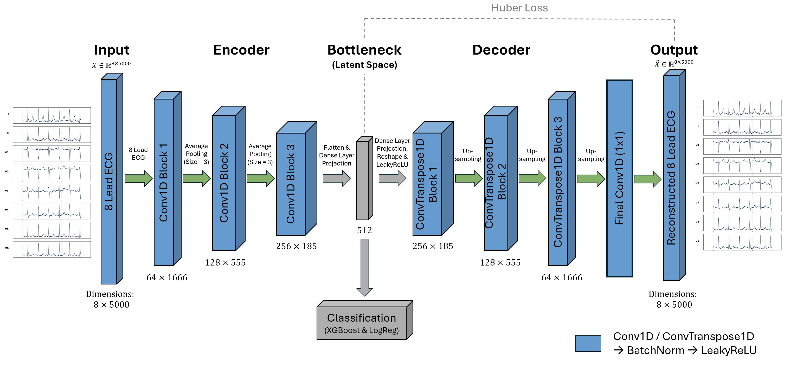

* Current top 5 results:

| Date               | Latent Dim | LR      | Kernel | Loss  | Avg Val RMSE | CI Val RMSE     | Avg Val R² | Avg XGB AUC | CI XGB AUC       | Avg XGB PRAUC | CI XGB PRAUC     | Avg LR AUC | CI LR AUC        | Avg LR PRAUC | CI LR PRAUC      |
|--------------------|------------|---------|--------|-------|--------------|------------------|------------|-------------|-------------------|----------------|-------------------|-------------|-------------------|---------------|-------------------|
| 18-04-2026 13:54   | 512        | 0.0005  | 85     | huber | 0.225        | [0.217, 0.234]   | 0.949      | 0.907       | [0.901, 0.912]    | 0.333          | [0.309, 0.357]    | 0.895       | [0.890, 0.900]    | 0.233         | [0.221, 0.244]    |
| 18-04-2026 04:24   | 512        | 0.0005  | 75     | huber | 0.223        | [0.219, 0.227]   | 0.950      | 0.903       | [0.899, 0.907]    | 0.327          | [0.309, 0.345]    | 0.893       | [0.886, 0.900]    | 0.230         | [0.209, 0.251]    |
| 17-04-2026 19:27   | 512        | 0.0005  | 65     | huber | 0.221        | [0.216, 0.226]   | 0.951      | 0.900       | [0.895, 0.904]    | 0.318          | [0.311, 0.324]    | 0.892       | [0.883, 0.902]    | 0.231         | [0.209, 0.253]    |
| 17-04-2026 08:45   | 512        | 0.0005  | 55     | huber | 0.221        | [0.216, 0.226]   | 0.951      | 0.896       | [0.892, 0.900]    | 0.306          | [0.297, 0.315]    | 0.888       | [0.879, 0.897]    | 0.225         | [0.205, 0.245]    |
| 19-04-2026 16:02   | 128        | 0.0005  | 45     | huber | 0.308        | [0.305, 0.310]   | 0.905      | 0.895       | [0.884, 0.905]    | 0.303          | [0.275, 0.332]    | 0.879       | [0.859, 0.900]    | 0.206         | [0.177, 0.235]    |
| 19-04-2026 22:01   | 64         | 0.0005  | 45     | huber | 0.362        | [0.358, 0.366]   | 0.869      | 0.894       | [0.886, 0.901]    | 0.284          | [0.260, 0.307]    | 0.830       | [0.789, 0.871]    | 0.165         | [0.138, 0.192]    |
| 17-04-2026 02:50   | 512        | 0.0005  | 45     | huber | 0.221        | [0.218, 0.223]   | 0.951      | 0.888       | [0.879, 0.896]    | 0.291          | [0.278, 0.303]    | 0.870       | [0.852, 0.887]    | 0.203         | [0.183, 0.223]    |
| 19-04-2026 11:12   | 256        | 0.0005  | 45     | huber | 0.264        | [0.259, 0.268]   | 0.930      | 0.886       | [0.880, 0.893]    | 0.277          | [0.251, 0.304]    | 0.853       | [0.825, 0.880]    | 0.180         | [0.142, 0.217]    |
| 15-04-2026 16:05   | 64         | 0.0005  | 9      | huber | 0.405        | [0.399, 0.410]   | 0.836      | 0.878       | [0.875, 0.881]    | 0.271          | [0.256, 0.286]    | 0.746       | [0.732, 0.761]    | 0.116         | [0.108, 0.124]    |

---
### Date: 06 April 2026

#### Who did you help this week?

* N/A

#### What helped you this week?

* Visualizing ECGs with atrial fibrillation to verify the labels.

* Comparing my project's architecture to existing literature to better understand the model's performance limitations and identify key methodological differences.

#### What did you achieve?

* Diagnosed the 0.50 AUC issue - I've proved that the model's failure to learn is due to misaligned or incorrect clinical labels, resulting in random guessing, rather than a flawed architecture.

* The project have been compared to several other studies. 
  * Main takeaway: Most studies process ECGs one beat or segment at a time, whereas my model processes 10 second ECGs. The closest existing methodology to mine is Friedman's use of a Denoising Autoencoder (DAE). 
I've summarised the existing research in the table below:

|                      | My Model | Eravci (Wavelet) | Kim (LSTM) | Song (CREMA) | Silva (Sparse AE) | Jiang (CAE-LSTM) | Shan (ECG-AAE) | Zhang (LRA-AE) | Friedman (DAE) |
|----------------------|----------|------------------|------------|--------------|-------------------|------------------|----------------|----------------|----------------|
| **Main Goal** | Explore latent space for anomaly detection | Automated Atrial Fibrillation detection | AFib detection using P-wave segments | General-purpose foundation model | Beat-by-beat mobile AFib detection | Predict future paroxysmal AFib attacks | Semi-supervised arrhythmia detection | Filter noise for precise arrhythmia classification | Discover cardiac and non-cardiac diseases |
| **Input Data** | Raw 1D signal | 2D scalogram | 1D segmented | Raw 1D / masked | ECG Shape | RR | Raw 1D signal | Raw 1D signal | Raw 1D signal |
| **Sequence Length** | 5000 (10 seconds) | Heartbeat-level | Segment-level | Variable (Transformer) | Beat-by-beat | Sequence of RR intervals | Beat-by-beat | Segment / Beat-by-beat | 10 seconds |
| **Model Type** | 1D CNN AE | 2D CNN AE | LSTM autoencoder | Foundation model | Sparse AE | CAE & LSTM | Adversarial AE (TCN) | Low-Rank Attention AE | Denoising Autoencoder |
| **Advantages** | Unconstrained end-to-end learning | Time-frequency representation | Isolates P-wave (PreQ) | Captures deep temporal context | Isolates shape | Captures long-term rhythm patterns | Learns both subtle and large features | Finds relationships across the whole signal | Unsupervised disease profiling |
| **Detection or Prediction** | Detection | Detection | Detection | Detection | Detection | Prediction | Detection | Detection | Both |

#### What did you struggle with?

* Achieving distinct clusters in the UMAP projections.

* Aligning the labels with the ECGs.

#### What would you like to work on next week?

* Figure out whether the labels can be used or not.

#### Where do you need help from Veronika & Jørgen?

* Jørgen, do you have any tips for alignment and what's the status on the other labels (gender, age, etc.)?

#### Any other topics
* [Slides - PURRlab Presentation](weekly_meetings_material/2026-04-07/PURRlab_5min_presentation.pdf)

---
### Date: 12 March 2026

#### Who did you help this week?

* N/A

#### What helped you this week?

* Discussing the UMAP results with Jørgen, which helped me investigate the limitations of our current model.

* Looking into existing literature to check why standard autoencoders struggle with arrhythmias.

#### What did you achieve?

* Added box plots to the slice plot and ran visualizations for the full model (See plots in 'Any other topics'). We will need some more runs to get more out of the plots.

* Updated the flowchart based on inspiration from the previous meeting - training and holdout sets are now kept separate (See diagram in 'Any other topics').

* Cleaned up the GitHub repository: Updated the naming convention, updated the README file, and changed the results from Excel to CSVs.

* Combined the Overleaf documents and expanded the methods section.

* Spend a lot of time on experimenting with different model architectures (FFT, adding a Classification head, and testing the latent space in a Hicks Network) to force distinct AFib clusters in the UMAP. We found out that the current model cannot separate AFib from normal ECGs

  * We are guessing that the poor clustering is due to, the model focuses on minimizing MSE, so it prioritizes large spikes like the QRS complex and ignores the subtle changes required to detect Atrial Fibrillation.

* I am therefore looking through the existing research, to see what we do differently and I have found 5 articles using slightly different approaches - the articles are added in the bottom of the Overleaf document. Changing the approach might result in better clustering.

  * This is in short my current findings:

    * Eravci et al. (2024): Converts 1D ECGs into 2D scalograms (Wavelet Transform) to feed into the Autoencoder.

    * Song et al. (2024): Replaces standard MSE with a Masked Autoencoder combined with Contrastive Regularization.

    * Kim et al. (2023): Splits the ECG into 3 segments (PreQ, QRS, PostS) and uses LSTMs to capture long-term temporal dependencies better than CNNs.

    * Jiang et al. (2023): Instead of raw voltage, uses an unsupervised Autoencoder to compress RR intervals into the latent space.

    * Silva et al. (2023): Uses beat-by-beat segmentation instead of continuous strips, incorporating Local Change of Successive Differences (LCSD) - used to measure short-term Heart Rate Variability.

#### What did you struggle with?

* Getting distinct AFib clusters in the UMAP projections.

* Uncertainty regarding the methodology, after discussing the UMAP results with Jørgen, I am unsure if we should keep the method as it currently is, or change direction based on the literature.

#### What would you like to work on next week?

* Decide what methodology to use.

#### Where do you need help from Veronika?

* Guidance on the methodology, should we keep the current methods and report the limitations, or change direction based on the methods found in the literature?

* Any other thoughts?

#### Any other topics
* Plots:
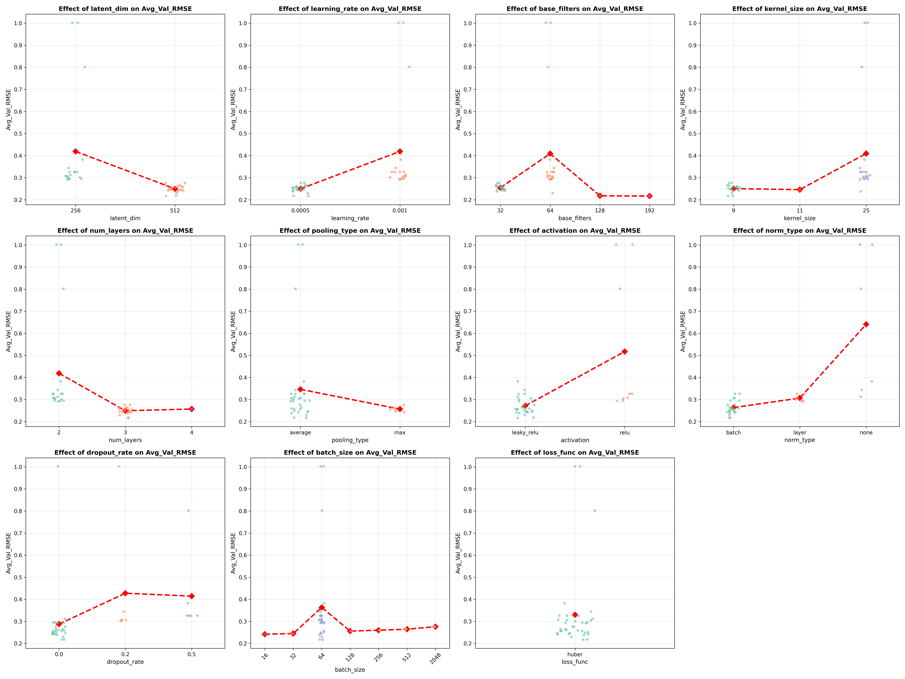
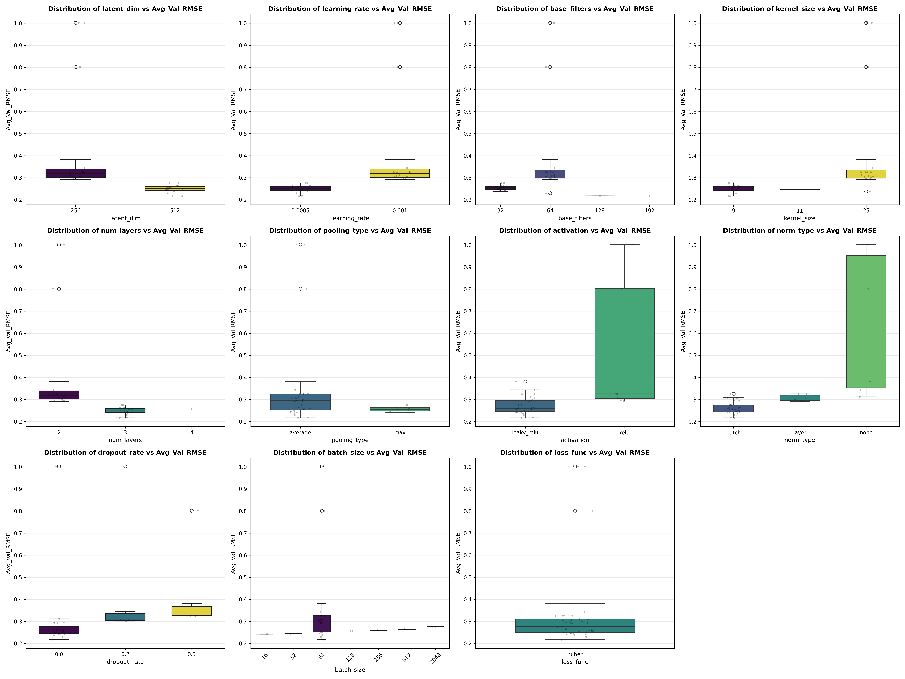
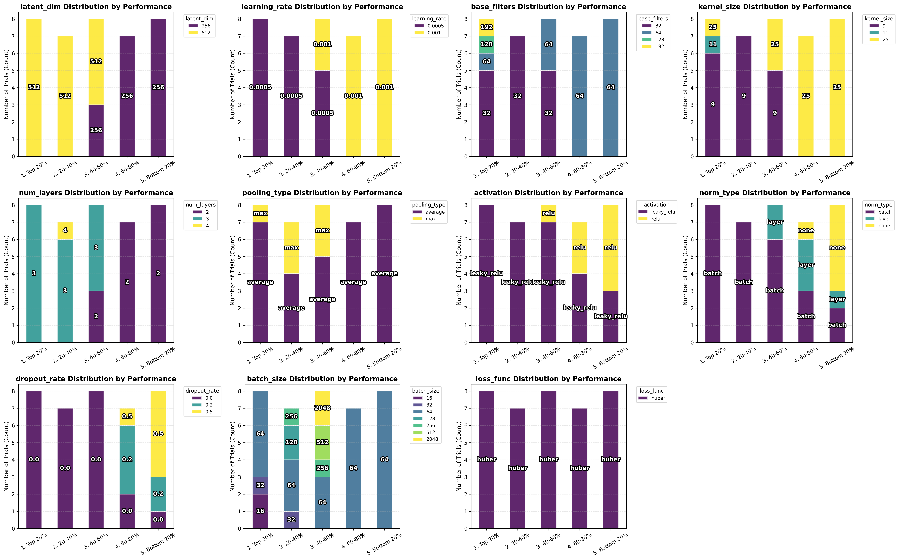
* Flowchart:
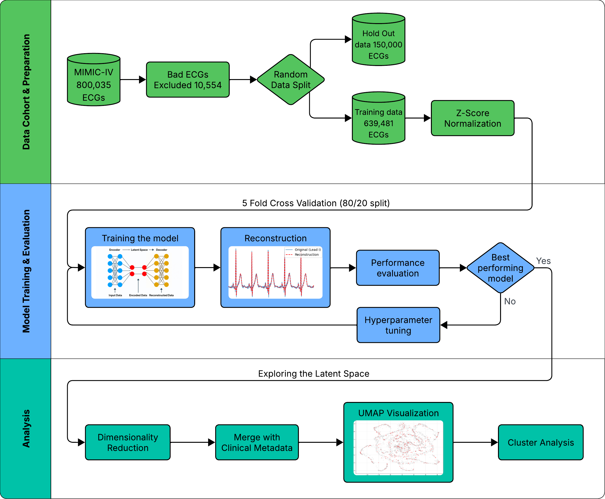

---

---
### Date: 05 March 2026

#### Who did you help this week?

* N/A

#### What helped you this week?

* The hyperparameter visualizations revealed new patterns and validated the ones I already expected.

#### What did you achieve?

* Defined the full dataset splits:
  * Training Set: 511,585 ECGs
  * Validation Set: 127,896 ECGs
  * Holdout Set: 150,000 ECGs
* Trained model on the full dataset using different batch sizes, experimenting with the best parameters from the top Optuna trials.
* Visualized the hyperparameters to find and confirm architectural patterns. 
* Read the Lab Guide again.
* Updated flowchart. 
* Investigated the "weird" learning curves in trials 125, 149, and 108: The latent space was large enough to memorize the small training set, resulting in an overfitting gap between training and validation loss. Increasing to the full dataset size forces the model to generalize, solving the problem. 
* Created `Notes.tex` in Overleaf for the final report, containing plots and other relevant information, such as the side experiment (how few cases are too few).

#### What did you struggle with?

* Getting the ground truth labels and overlaying them on the UMAP-Projection.

#### What would you like to work on next week?

* Continue cleaning the labels.
* UMAP Projection.
  * Experiment with different parameters.
  * Add more labels to the UMAP projection.
* Brainstorm ideas for the next set of experiments.
* Create hyperparameter visualizations for the full model.

#### Where do you need help from Veronika?

* Discussion of the hyperparameter visualizations.
* Reviewing the updated flowchart.
* Discussing the latest results from the full dataset training runs.

#### Any other topics

* **Hyperparameter visualizations - 10K ECGs**
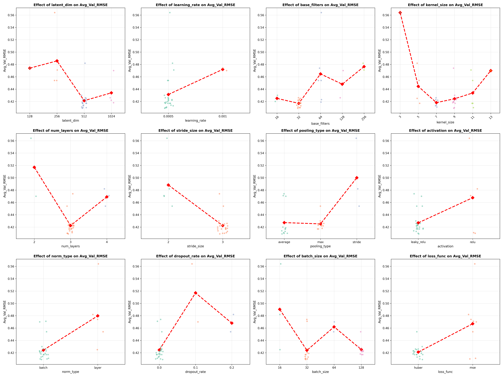
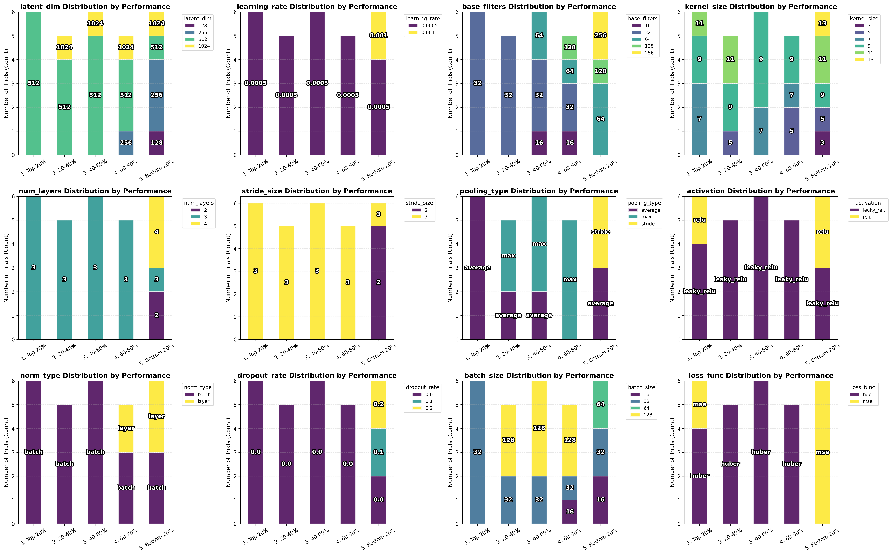

* **Flowchart**
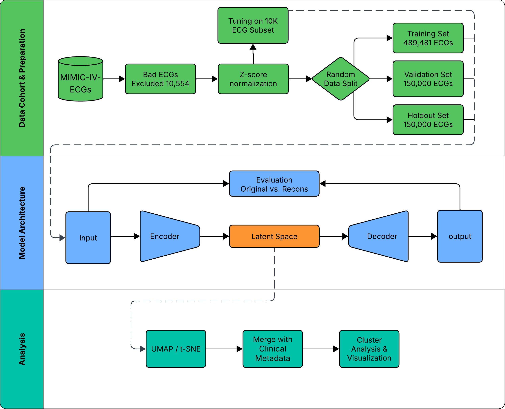

* **Full dataset - best performing model**

  * [Results - (Excel-file)](weekly_meetings_material/2026-03-05/Results.xlsx)

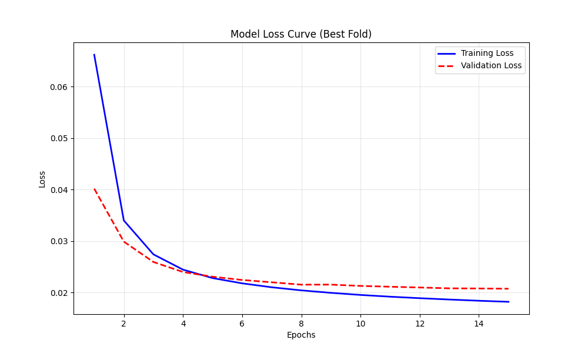

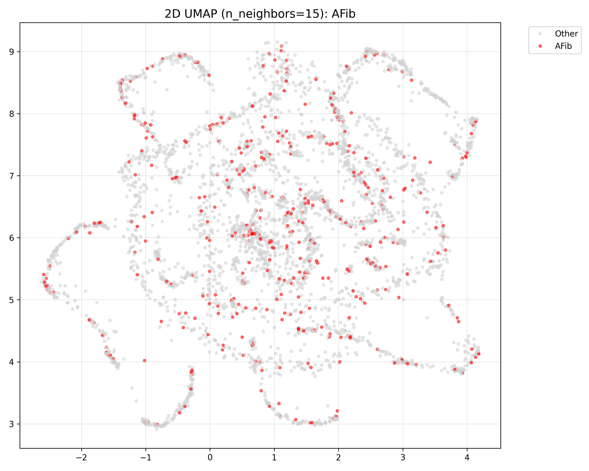

  * [AFib UMAP 3D (n=15)](weekly_meetings_material/2026-03-05/AFib_umap_3d_n15.html)

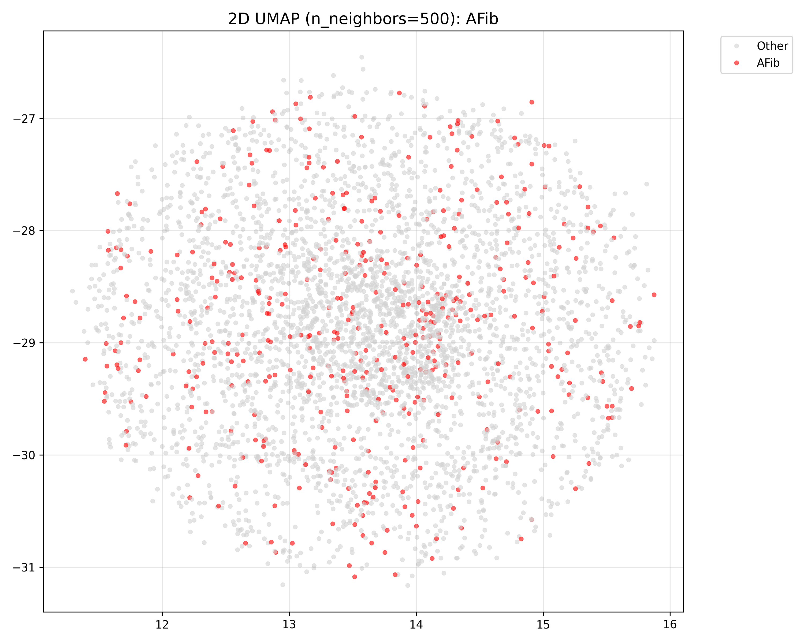

  * [AFib UMAP 3D (n=500)](weekly_meetings_material/2026-03-05/AFib_umap_3d_n500.html)

---

### Date: 26 February 2026

#### Who did you help this week?

* I helped Jørgen prepare the MIMIC-IV dataset for the MUSE database.

#### What helped you this week?

* Converting the script from TensorFlow to PyTorch improved GPU compatibility and training performance.
* Using Optuna instead of RandomizedSearchCV. Optuna is based on Bayesian optimization (TPE algorithm) - effective at exploring parameter combinations and pruning poor-performing models.

#### What did you achieve?

* Implemented cross-validation.
* Experimented with the agreed hyperparameters using Optuna.
* Completed the "How few cases are too few?" side experiment to investigate the "too good" loss curves:
  * Used a fixed validation set of 1,000 ECGs.
  * The model performance starts noticeably decreasing around ~2,000 ECGs. 
* Literature Review: Extracted interesting articles using Lens, explored literature visualizations, and updated the Overleaf document.
* Drafted the initial flowcharts.

#### What did you struggle with?

* Dataset Labels - waiting for the MIMIC-IV diagnostic labels (Jørgen is working on a solution). This delays adding labels to the UMAP projection and stratifying the 150,000 ECG holdout set.
* Struggled with GPU compatibility, requiring a lot of work to convert the entire model architecture to PyTorch.

#### What would you like to work on next week?

* Run the model on the full dataset using a large batch size. I will test hyperparameters from Optuna Trial 138 and Trial 54 due to their more stable learning curves.
* Create a completely random 150,000 ECG holdout set until I get the clinical labels (approved by Veronika, we will check the distributions later and re-stratify if necessary).
* Visualize the parameters using plots (and maybe heatmaps) to identify patterns among the top 10%, 20% etc. best-performing models from the Optuna CSV.
* Investigate and write an explanation for why the learning curves look "weird" for trials 125, 149, and 108.
* Add the"How few cases are too few?" plot to Overleaf 
* Revise the flowchart with cross-lane arrows.
* Re-read the Lab Guide.

#### Where do you need help from Veronika?

* Feedback on the hyperparameter pattern visualizations once I have generated them based on her drawings.
* Reviewing the updated flowchart once the swimlane arrows are added.

#### Any other topics

* Meeting Schedule, we agreed to skip the second meeting scheduled for next Thursday.
* Meeting Structure, discussed suggestions for agenda structure and formatting for future meetings. I'm going to use this template.

---
### Date: 19 February 2026

#### Who did you help this week?

* N/A 

#### What helped you this week?

* Being at the KU office and getting help from Jonas and Jørgen to set up access to the server for training the models.
* Daily discussions about the results with Jørgen.
* Feedback from this week's supervision, which provided a lot of guidance for future work.

#### What did you achieve?

Previous weeks todo list:
* Called SAP and registered supervisors.
* Set up the GitHub repository and Overleaf Project with matching titles.
* Wrote the Problem Statement and got it approved.
* Reviewed the guidelines for writing in preparation for the Overleaf document.
* Checked the consistency of the ECG files and created a log-file.

Other achievements:
* Built a basic CNN-autoencoder and tested it on 5,000 and 800,000 ECGs.
* Completed 16 runs with 5,000 ECGs - the model prefers higher dimensionality and larger filters.

#### What did you struggle with?

* The model crashed when training on the full dataset - this is hopefully solved by lowering the batch size to 128.
* The loss curve looks "too good," Veronica suggests a side experiment to determine how few cases are too few.
* Needed clarification on how to structure flowcharts for methods and inclusion/exclusion criteria.

#### What would you like to work on next week?

* Continue the Literature Review using tools like Lens, PubMed, and OpenAlex.
* Implement cross-validation - An 80/20 split on 5,000 ECGs can give misleadingly results, since the model can recieve a "easy" or noisy batch. Cross‑validation averages across many splits, making it possible to check if the models are significantly different.
* Experiment with different hyperparameters using ([RandomizedSearchCV](https://medium.com/@bhagyarana80/tuning-hyperparameters-like-a-pro-with-gridsearchcv-and-randomizedsearchcv-611565c0e551)), testing higher dimensionality, kernels, filters, pooling, dropout rates, and strides.
* Add labels to the UMAP projection by updating the metadata without rerunning the UMAP.
* Establish the hold out set of 150,000 ECGs using stratification to maintain similar distributions across age groups and gender.
* Draft flowcharts for the methods and inclusion/exclusion criteria, referencing the ([PRISMA-Statement](https://www.prisma-statement.org/)).

#### Where do you need help from Veronika?

* Feedback on my work once I've implemented cross-validation, RandomizedSearchCV, and added labels to the UMAP.
* Discussing and getting feedback on the flowcharts for the methods and the inclusion/exclusion criteria.
* Discussing existing papers to include in the Literature Review.
* Guidance on stratifying the 150,000 ECG hold-out dataset.

#### Any other topics

* N/A

---

### Date: 05 February 2026

#### Who did you help this week?

N/A (This was the first supervision meeting).

#### What helped you this week?

The meeting with Jørgen and Veronika helped clarify the direction for the project.

#### What did you achieve?

* Agreed on Project Scope & Data:

  * Dataset: MIMIC-IV-ECG (approx. 800,000 ECGs, 160,000 patients).

  * Data specs: 12 leads, 10 seconds long, 500 Hz (5,000 points), WFDB format 16.

  * Source: Beth Israel Deaconess Medical Center (2008–2019).

* Methodology:

  * Build a CNN-based autoencoder to explore the latent space (e.g., to find AFib clusters).

  * Apply dimensionality reduction (UMAP/t-SNE) to visualize vectors (e.g., 64 dimensions to x/y coordinates).

  * Training will occur on Jørgen’s hardware.

* Practicalities:

  * Fixed days: ITU on Thursday afternoons, KU on Tuesdays.

  * Project Title: "Project of Anton - Unsupervised Deep Learning of ECGs: Exploring the Latent Space".

#### What did you struggle with?

* Uncertainty regarding the direction of the project and administrative access (seeing the thesis in LearnIT and getting access to KU's systems).

#### What would you like to work on next week?

* Call SAP to check LearnIT access, confirm title registration, and clarify problem statement deadlines.

  * Register supervisor with SAP using the title: "Project of Anton - Unsupervised Deep Learning of ECGs: Exploring the Latent Space".

* Set up a regular GitHub repository ([Template](https://github.com/drivendataorg/cookiecutter-data-science)) and create a WeeklyMeetings.md file.

* Set up Overleaf in a separate repository ([Template](https://www.overleaf.com/latex/templates/ieee-conference-template/grfzhhncsfqn)).

* Create README and Requirements files.

* Draft the Problem Statement.

* Create a flowchart for Inclusion/Exclusion criteria and Methods.

* Review guidelines for writing.

* Check ECG file consistency and create a log-file (Task assigned by Jørgen 06/02).

#### Where do you need help from Veronika?

* Providing feedback for the Problem Statement.

#### Any other topics

* Availability: I have a 15-hour side job to balance with the thesis.

* Vacation: I have 2 weeks of vacation planned for March.

---

### Date: [Template]

#### Who did you help this week?

#### What helped you this week?

Replace this text with a one/two sentence description of what helped you this week and how.

#### What did you achieve?

* Replace this text with a bullet point list of what you achieved this week.
* It's ok if your list is only one bullet point long!

#### What did you struggle with?

* Replace this text with a bullet point list of where you struggled this week.
* It's ok if your list is only one bullet point long!

#### What would you like to work on next week?

* Replace this text with a bullet point list of what you would like to work on next week.
* It's ok if your list is only one bullet point long!
* Try to estimate how long each task will take.

#### Where do you need help from Veronika?

* Replace this text with a bullet point list of what you need help from Veronika on.
* It's ok if your list is only one bullet point long!
* Try to estimate how long each task will take.

#### Any other topics

This space is yours to add to as needed.
